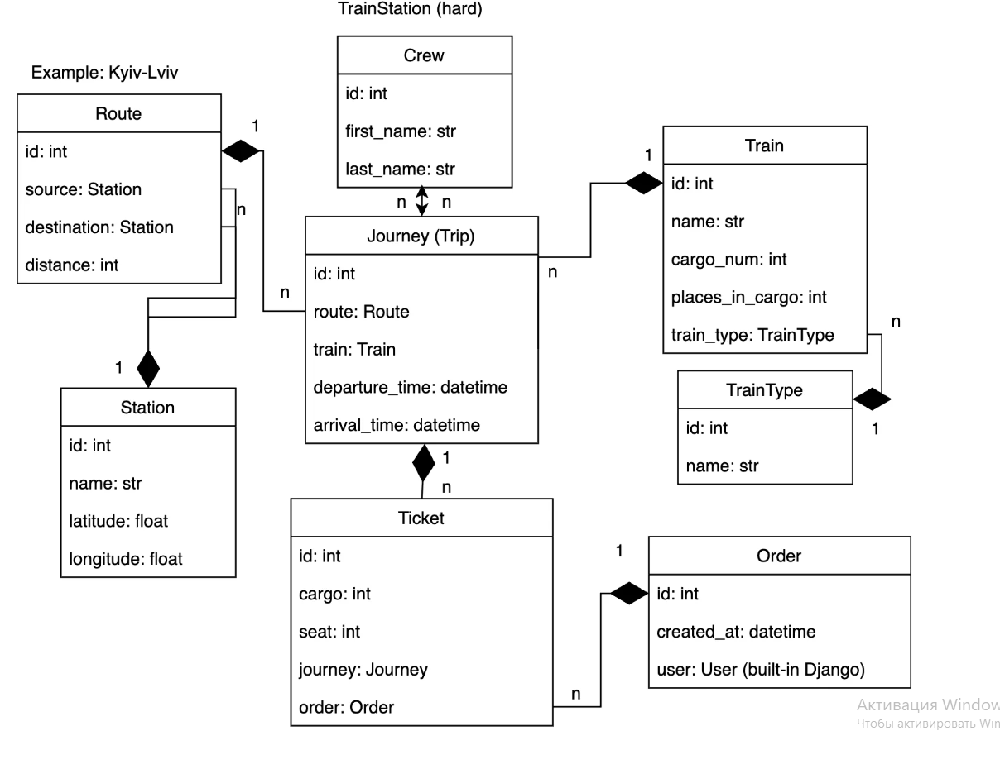

# API_service_for_a_railway_station
## Project description
  ***API_service_for_a_railway_station*** - is a RESTful API service for railway station management that allows you to create, view, filter, and interact with entities such as routes, trains, flights, stations, etc.

___
### Database Structure:
- railway_station 

___
 Features

 User authentication (JWT)

 CRUD for:

Stations

Trains (Trains)

Routes (Routes)

Journeys

Train types (Train Types)

 Filter trains by:

route

train

time of departure

 Support for Docker and Docker Compose

Test coverage (Pytest, Django TestCase)
___
##  Installation

### 1️ **Clone the repository**. 
https://github.com/andreykolomiec/API_service_for_a_railway_station

### 2️ Create a virtual environment and activate it
python -m venv venv
- Windows:
  - venv\Scripts\activate

- Mac/Linux:
  - source venv/bin/activate

### 3️ Setting up dependencies
pip install -r requirements.txt

### 4 Setting up the database and applying migrations
python manage.py migrate

### 5️ Create a superuser (for access to the admin panel)
python manage.py createsuperuser

### 6️ Starting the server
python manage.py runserver

##  Run from Docker Hub
Docker should be installed

### 1️ **Clone the Docker Hub repository:**
https://hub.docker.com/repository/docker/akolomiec982/api_service_for_a_railway_station/tags

### 2️ Download the image from Docker Hub:
docker pull akolomiec982/api_service_for_a_railway_station:latest

### 3️ Run the application:
docker-compose up --build

### 4 Create migrations
docker-compose exec railway_station python manage.py migrate

### 5️ (Optional) Create a superuser:
docker-compose exec railway_station python manage.py createsuperuser

### 6️ Run tests inside the railway_station container:
docker-compose exec railway_station python manage.py test

### The application will be available at: http://127.0.0.1:8001/
### To access the page after registration: http://127.0.0.1:8001/api/railway/

##  Authentication & User Endpoints
This API uses JWT (JSON Web Tokens) for user authentication. Here is a list of available endpoints for working with users and tokens:

###  POST /api/user/register/
New user registration.
Expects fields.: email, password.

###  POST /api/user/token/
Receiving a JWT token (login).
Expects the fields: email, password.

###  POST /api/user/token/refresh/
Access token refresh (when the access token has expired, but there is a valid refresh token).

###  POST /api/user/token/verify/
Checking the validity of the JWT token.

###  GET /api/user/me/
Get detailed information about the authorized user.
 Requires Authorization: Bearer <access_token>.

###  GET /api/schema/
OpenAPI 3.0 schema (in JSON or YAML format)
- This route returns the full API schema that can be used in third-party tools such as Postman, Swagger Editor, Stoplight, etc.
- Usage:
- To generate documentation.
- To import APIs into client applications
- To check the description of all routes, models, and parameters
 ### GET /api/doc/swagger/
- Swagger UI is an interactive web-based documentation that allows you to:
- View all available API routes
- Make requests directly from the browser (authentication is supported)
- Check input/output schemes

### GET /api/doc/redoc/
- Redoc UI - structured API documentation with detailed descriptions.
- List of all endpoints
- Model description

## Technology:
### Backend:
- Python 3.10+ - the main programming language
- Django 5.2 - a web framework for building APIs and server logic
- Django REST Framework 3.16.0 - REST API for Django
- djangorestframework-simplejwt 5.5.0 - JWT authentication (registration, login, token refresh)
- drf-spectacular 0.28.0 - auto-generation of OpenAPI schemas (Swagger, Redoc)
- django-debug-toolbar 5.2.0 - panel for debugging Django in development
- sqlparse 0.5.3 - formatting of SQL queries (used by Django)
- asgiref 3.8.1 - ASGI reference implementation, Django dependency
- tzdata 2025.2 - support for time zones

### Additional libraries:
- pillow 11.2.1 - image processing
- psycopg 3.2.9 / psycopg-binary 3.2.9 - driver for connecting to PostgreSQL
- PyJWT 2.9.0 - JWT encoding/decoding (SimpleJWT is used)
- PyYAML 6.0.2 - work with YAML (used in API documentation)
- inflection 0.5.1 - changing the shape of words (can be used to convert names in serializers)
- attrs, referencing, rpds-py, jsonschema, jsonschema-specifications, uritemplate - dependencies for validating JSON and OpenAPI schemas

### Tools for code quality:
- flake8 7.2.0 - Python code style analysis
- pycodestyle 2.13.0 - PEP8 style
- pyflakes 3.3.2 - detecting errors in the code
- mccabe 0.7.0 - checking code complexity

### Database:
- PostgreSQL 16 - relational database
- psycopg 3.2.9 - PostgreSQL driver for Python

### Infrastructure:
- Docker - application containerization
- Docker Compose - managing a multi-container environment (Django + PostgreSQL)
- .env files - for managing environment variables

### Development Tools:
- flake8 - Python code linting
- django-debug-toolbar - debugging tools in development mode
- Pillow - image processing in Django (for example, if avatars or files are loaded)
- jsonschema - checking the structure of JSON data

### Documentation
- Swagger UI - interactive API documentation
- Redoc - readable HTML API documentation

## Authors:
- andreykolomiec (https://github.com/andreykolomiec/API_service_for_a_railway_station)

